# Inventory Management Platform
> A production-style Inventory Management Platform built with **ASP.NET Core 10**, **Clean Architecture**, **Rich Domain Modeling**, **CQRS-inspired Application Layer**, and **Entity Framework Core**. The project demonstrates enterprise software development practices through modular business capabilities, workflow-driven domain models, and maintainable architecture.

The project is designed as a production-style portfolio application that demonstrates enterprise software development practices including layered architecture, reusable infrastructure, server-side data processing, and maintainable code organization.

---

## Highlights

- Enterprise-style Clean Architecture
- ASP.NET Core 10 Razor Pages
- Entity Framework Core 10
- CQRS-inspired Application Layer
- Inventory transaction workflow with immutable history
- Server-side search, sorting, and pagination
- Reusable shared infrastructure
- Business analytics dashboard
- Workflow-driven Purchasing module
- Read-oriented Reporting architecture
- Inventory Valuation
- Purchase History
- Supplier Purchase Analysis
- Stock Movement
- Low Stock Report
- Inventory Movement Report
- Product Reports
- Excel Export
- PDF Export
- Rich Domain Model
- Vertical Slice Architecture


---

# Why This Project?

Many portfolio projects demonstrate CRUD functionality. This project goes beyond CRUD by emphasizing maintainable architecture, enterprise development practices, and scalable software design.

The focus is not only on implementing business features but also on applying professional engineering practices such as architectural reviews, feature-based organization, incremental refactoring, and comprehensive documentation.

---

## Project Status

**Current Version:** v1.4.0 - Additional Reporting & Exports

**Current Development Status:** Sprint 7 Additional Reporting — Complete and Verified

## Completed Modules

- ✅ Product Management
- ✅ Category Management
- ✅ Supplier Management
- ✅ Customer Management
- ✅ Unit Management
- ✅ Inventory Transactions
- ✅ Dashboard
- ✅ Authentication & Authorization
- ✅ User Management
- ✅ Account Management
- 🟨 Purchasing (Core Workflow Complete)
- ✅ Reporting (Sprint 7 Additional Reporting Complete and Verified)

## Latest Release

## v1.4.0 - Additional Reporting & Exports

### Highlights

#### Reporting

- Inventory Valuation
- Purchase History
- Supplier Purchase Analysis
- Stock Movement
- Low Stock Report
- Inventory Movement Report
- Product Reports

#### Export

- Excel Export for all seven reports
- PDF Export for all seven reports
- Existing report filters preserved during export
- Existing report sorting preserved during export
- Full filtered result set exported without UI pagination limits
- Inventory Valuation Total Inventory Value included in Excel and PDF output

#### Verification

- All seven reports browser/manual verified
- All seven Excel exports verified
- All seven PDF exports verified
- Empty database behavior verified
- Explicit query-failure behavior verified
- Database recovery verified
- Existing authorization boundaries verified
- Final project-wide verification completed

The release preserves the established read-oriented Reporting architecture and isolates PDF generation in the Web layer using QuestPDF.

---

## Architecture Validation

The project completed **Architecture Sprint 1**, a comprehensive architectural review covering the Application, Infrastructure, and Web layers.

Sprint 3 validated the architecture through the Purchasing Application layer, while Sprint 4 extended that validation into the Presentation layer by delivering a complete browser-accessible Purchasing workflow.

Sprint 5 extended the architecture into dedicated read-oriented Reporting through Inventory Valuation.

Sprint 6 extended the architecture into self-service Account Management.

The Account Management implementation validated the existing Identity abstraction, Application handler patterns, Razor Pages workflow, and separation between administrative User Management and self-service account management.

The Account Management vertical slice was implemented without requiring structural architectural redesign.

### Account Management Validation

- ✅ Profile management
- ✅ Password management
- ✅ Email verification
- ✅ Two-factor authentication
- ✅ Recovery code authentication
- ✅ Self-service authorization boundaries

### Reporting Validation

The Reporting path is:

```text
Presentation
     ↓
Application Handler
     ↓
Read Model
     ↓
Repository Abstraction
     ↓
Infrastructure Repository
     ↓
EF Core Projection
     ↓
Database
```

The implementation uses a dedicated DTO projection and does not modify Domain entities.

The first Reporting vertical slice was implemented without requiring structural architectural redesign.

### Review Outcome
- ✅ Application layer validated
- ✅ Infrastructure layer validated
- ✅ Web layer validated
- ✅ Architecture approved for future module expansion

The completed Purchasing, Reporting, and Account Management vertical slices further validated that the existing architecture can support CRUD-oriented modules, workflow-driven business processes, read-oriented reporting, and self-service account security workflows without requiring structural redesign.

---

# Project Goals

This project aims to demonstrate:

- Clean Architecture
- Repository Pattern
- Result Pattern
- Dependency Injection
- Entity Framework Core
- Razor Pages
- Server-side Searching
- Server-side Sorting
- Server-side Pagination
- Reusable Filtering Infrastructure
- Scalable Module Design

The long-term goal is to evolve this project into a complete inventory management system suitable for small and medium-sized businesses.

---

# Enterprise Features

- Clean Architecture
- Repository Pattern
- Unit of Work
- Result Pattern
- CQRS-style Application Layer
- Entity Framework Core Configurations
- Server-side Paging
- Server-side Sorting
- Server-side Filtering
- Soft Activation / Deactivation
- Shared Infrastructure
- Inventory Transaction History
- Inventory Audit Trail
- Immutable Business Records
- Automatic Stock Management
- Business Dashboard
- Dedicated Reporting Read Models
- Read-only EF Core Projections
- Inventory Valuation Reporting
- ASP.NET Core Identity
- Cookie Authentication
- Role-based Authorization
- User Management
- Password Management
- Self-Service Account Management
- Email Verification
- Two-Factor Authentication
- Recovery Code Management
- Architecture Review Process
- Feature-first Organization
- ASP.NET Core Identity Isolation
- Engineering Documentation
- Rich Domain Model
- Vertical Slice Architecture
- Workflow-driven Business Processes
- Dedicated Read Models
- Business-oriented Application Handlers

---

# Current Features

## Product Management

### Product Lifecycle

- ✅ Create Product
- ✅ View Product Details
- ✅ Edit Product
- ✅ Activate Product
- ✅ Deactivate Product
- ✅ Add Barcode
- ✅ Dropdown Category
- ✅ Dropdown Unit
- ✅ Add Quantity On Hand

### Product Listing

- ✅ Server-side Search
- ✅ Server-side Pagination
- ✅ Server-side Sorting
- ✅ Status Filtering
- ✅ Success Notifications

## Category Management

### Category Lifecycle

- ✅ Create Category
- ✅ View Category Details
- ✅ Edit Category
- ✅ Activate Category
- ✅ Deactivate Category

### Category Listing

- ✅ Server-side Search
- ✅ Server-side Pagination
- ✅ Server-side Sorting
- ✅ Status Filtering
- ✅ Success Notifications

## Supplier Management

### Supplier Lifecycle

- ✅ Create Supplier
- ✅ View Supplier Details
- ✅ Edit Supplier
- ✅ Activate Supplier
- ✅ Deactivate Supplier

### Supplier Listing

- ✅ Server-side Search
- ✅ Server-side Pagination
- ✅ Server-side Sorting
- ✅ Status Filtering
- ✅ Success Notifications

## Customer Management

### Customer Lifecycle

- ✅ Create Customer
- ✅ View Customer Details
- ✅ Edit Customer
- ✅ Activate Customer
- ✅ Deactivate Customer

### Customer Listing

- ✅ Server-side Search
- ✅ Server-side Pagination
- ✅ Server-side Sorting
- ✅ Status Filtering
- ✅ Success Notifications

## Inventory Transactions

### Inventory Workflow

- ✅ Create Inventory Transaction
- ✅ View Transaction Details
- ✅ Stock In
- ✅ Stock Out
- ✅ Stock Adjustment

### Transaction Listing

- ✅ Server-side Search
- ✅ Server-side Pagination
- ✅ Server-side Sorting
- ✅ Success Notifications

### Business Rules

- ✅ Immutable transaction history
- ✅ Automatic Quantity On Hand updates
- ✅ Stock validation
- ✅ Inventory audit trail

## Purchasing

### Purchase Order Workflow

- ✅ Create Purchase Order
- ✅ Get Purchase Order
- ✅ Get Purchase Orders
- ✅ Submit Purchase Order
- ✅ Approve Purchase Order
- ✅ Receive Purchase Order
- ✅ Partial Purchase Order Receiving
- ✅ Final Purchase Order Receiving
- ✅ Completed Purchase Order State

### Purchase Order Presentation

- ✅ Purchase Order Listing
- ✅ Purchase Order Creation
- ✅ Purchase Order Details
- ✅ Supplier Selection
- ✅ Product Selection
- ✅ Expected Delivery Date
- ✅ Remarks
- ✅ Ordered Quantity Display
- ✅ Received Quantity Display
- ✅ Remaining Quantity Display
- ✅ Calculated Purchase Order Total

### Validation and Feedback

- ✅ Client-side Receive Quantity Validation
- ✅ Domain Receive Quantity Validation
- ✅ Validation Summaries
- ✅ Success Messages
- ✅ Index Query Failure Feedback
- ✅ Supplier Query Failure Feedback
- ✅ Product Query Failure Feedback

### Workflow

```text
Draft
  ↓ Submit
Submitted
  ↓ Approve
Approved
  ↓ Receive partial quantity
Receiving
  ↓ Receive remaining quantity
Completed
```

### Architectural Highlights

- Rich Domain Model
- Vertical Slice Architecture
- Workflow-driven Business Processes
- Dedicated Read Models
- Business-oriented Application Handlers
- Thin Razor PageModels
- Application Handler-driven Presentation

### Domain Design

- Rich Domain Model
- Workflow-driven state transitions
- Aggregate-based business behavior
- Thin Application handlers

## Reporting

### Inventory Valuation

- ✅ Inventory Valuation Report
- ✅ Inventory Valuation Read Model
- ✅ Inventory Valuation Application Handler
- ✅ Inventory Valuation Persistence Abstraction
- ✅ Inventory Valuation Repository
- ✅ Read-only EF Core Projection
- ✅ Product-level Inventory Valuation
- ✅ Category Projection
- ✅ Quantity On Hand Display
- ✅ Cost Price Display
- ✅ Inventory Value Display
- ✅ Total Inventory Value
- ✅ Inventory Valuation Navigation
- ✅ Dashboard/Report Value Consistency
- ✅ Browser Verification

### Inventory Valuation Calculation

```text
Inventory Value
= QuantityOnHand × CostPrice
```

The report uses actual persisted Product and Category data.

### Reporting Architecture

```text
Presentation
     ↓
Application
     ↓
Read Model
     ↓
Infrastructure
     ↓
Database
```

### Reporting Status

Sprint 7 Additional Reporting is complete and verified.

Completed reporting capabilities and exports:

- ✅ Inventory Valuation
- ✅ Purchase History
- ✅ Supplier Purchase Analysis
- ✅ Stock Movement
- ✅ Low Stock Report
- ✅ Inventory Movement Report
- ✅ Product Reports
- ✅ Excel Export
- ✅ PDF Export

Final project-wide verification is complete, including application regression, reporting verification, export verification, empty-database behavior, explicit query-failure behavior and recovery, authorization regression, and final build verification.


## Dashboard

### Dashboard Overview

- ✅ Inventory statistics
- ✅ Inventory value summary
- ✅ Recent inventory transactions
- ✅ Low stock products
- ✅ Refresh dashboard

### Dashboard Widgets

- ✅ Product statistics
- ✅ Inventory value
- ✅ Recent transactions
- ✅ Low stock monitoring
- ✅ Empty state handling

## Authentication

- ✅ Login
- ✅ Logout
- ✅ Cookie Authentication
- ✅ Role-based Authorization
- ✅ ASP.NET Core Identity
- ✅ Identity Cookie Authentication

## User Management

### User Lifecycle

- ✅ Create User
- ✅ View User Details
- ✅ Edit User
- ✅ Activate User
- ✅ Deactivate User
- ✅ Reset Password

### Role Management

- ✅ Assign Roles

### User Listing

- ✅ Server-side Search
- ✅ Server-side Pagination
- ✅ Server-side Sorting
- ✅ Status Filtering

---

## Account Management

### Profile

- ✅ User Profile
- ✅ Update Profile
- ✅ Self-Service Account Management

### Password Management

- ✅ Change Password
- ✅ Forgot Password
- ✅ Reset Password
- ✅ Force Password Change

### Email Verification

- ✅ Email Verification
- ✅ Verification Request
- ✅ Email Confirmation

### Two-Factor Authentication

- ✅ 2FA Setup
- ✅ TOTP Verification
- ✅ 2FA Login Challenge
- ✅ Recovery Codes
- ✅ Recovery Code Login
- ✅ Recovery Code Regeneration
- ✅ Recovery Code Invalidation
- ✅ Disable 2FA

---

# Architecture

The solution follows a layered Clean Architecture approach.

```text
InventoryPlatform
│
├── InventoryPlatform.Web
│
├── InventoryPlatform.Application
│
├── InventoryPlatform.Domain
│
├── InventoryPlatform.Infrastructure
│
└── InventoryPlatform.Shared
```

## Inventory Transaction Workflow

```text
Create Transaction
        │
        ▼
Application Handler
        │
        ▼
Domain Logic
        │
        ▼
Update Product Quantity
        │
        ▼
Persist Inventory Transaction
        │
        ▼
Return Result
```

## Purchasing Workflow

```text
Razor Page
     ↓
Application Handler
     ↓
PurchaseOrder Aggregate
     ↓
Repository / Unit of Work
     ↓
Database
     ↓
Result
```

The Purchase Order Details page exposes workflow actions such as Submit, Approve, and Receive while the Domain aggregate remains responsible for enforcing business rules and state transitions.

Responsibilities:
```text
InventoryPlatform
│
├── Web
│     Razor Pages
│
├── Application
│     Features
│     Handlers
│
├── Domain
│     Entities
│
├── Infrastructure
│     EF Core
│     Identity
│
└── Shared
      Paging
      Filtering
      Sorting
```

## Solution Architecture
```text
Request

↓

Razor Page

↓

Application Handler

↓

Domain Aggregate

↓

Repository / IdentityService

↓

Entity Framework Core

↓

SQL Server
```

## Architectural Principles

- Feature-first organization
- Clean Architecture
- Thin Razor PageModels
- Application Handler-driven Presentation
- Workflow-oriented Razor Pages
- Thin Application Handlers
- Business logic isolated from the Presentation layer
- ASP.NET Core Identity encapsulated behind IIdentityService
- Incremental refactoring guided by the Rule of Three
- Vertical Slice Architecture
- Request / Response / Handler pattern
- Rich Domain Model
- Workflow-oriented business commands
- Dedicated Read Models

---

## Architecture Validation

Architecture Sprint 1 confirmed:

- Thin Application Handlers
- Rich Domain Model
- Repository Pattern
- Unit of Work
- Identity Isolation
- Feature-first organization
- Razor Pages architecture

No major architectural redesign was required.

---

## Implemented Patterns

- Clean Architecture
- Repository Pattern
- Unit of Work
- CQRS-style Application Layer
- Result Pattern
- FluentValidation
- Dependency Injection
- Entity Framework Core Configurations
- Razor Pages
- Feature-based Architecture
- ASP.NET Core Identity
- Role-based Authorization
- Dependency Injection Extensions
- Thin PageModels
- Thin Handlers
- Feature-first Architecture
- Architecture Review Process
- Rule of Three Refactoring
- Vertical Slice Architecture
- Rich Domain Model
- Workflow-driven Business Processes
- Dedicated Read Models

---

# Key Design Decisions

- Inventory transactions are immutable.
- Product quantity is maintained through domain methods.
- Stock movements are recorded for every inventory change.
- Business logic resides in the Application and Domain layers.
- Razor Pages interact only with the Application layer.
- Dashboard data is composed using read-only DTO projections optimized for reporting.
- Identity operations are encapsulated behind IIdentityService.
- Authentication uses ASP.NET Core Identity.
- Administrative user management is separated from self-service account management.
- Business logic remains outside the Razor Pages.
- Business behavior resides inside Domain entities.
- Application handlers orchestrate workflows rather than implement business rules.
- Purchase Orders are implemented as workflow-driven aggregates.
- Purchase Order workflow actions are exposed through the Details page.
- Purchase Order receiving is performed at the Purchase Order Item level.
- Purchase Order totals remain calculated from Purchase Order items.
- Client-side validation improves user experience while Domain validation remains authoritative.

---

# Shared Infrastructure

Reusable infrastructure has been implemented to support future modules.

## Paging

- PagedRequest
- PagedQuery
- PagedResult\<T>

## Filtering

- StatusFilter enum (shared across all modules)

## Sorting

- ProductSortFields
- CategorySortFields
- SupplierSortFields
- CustomerSortFields
- UnitSortFields
- InventoryTransactionSortFields
- UserSortFields
- RoleOption

## Result Pattern

- Result
- Result\<T>

This infrastructure is shared across the Product, Category, Supplier, Customer, Unit, Inventory Transaction, and Purchasing modules where applicable.

---

# Technology Stack

Backend

- ASP.NET Core 10
- Razor Pages
- Entity Framework Core 10
- SQL Server
- LINQ
- Microsoft ASP.NET Core Identity

Architecture

- Clean Architecture
- Repository Pattern
- Dependency Injection
- Result Pattern

Frontend

- Bootstrap 5
- HTML5
- CSS3

Development Tools

- Visual Studio 2026
- Git
- GitHub
- SQL Server Management Studio

---

# Current Progress

| Module | Status |
|----------|--------|
| Product Management | ✅ Complete |
| Category Management | ✅ Complete |
| Supplier Management | ✅ Complete |
| Customer Management | ✅ Complete |
| Unit Management | ✅ Complete |
| Inventory Transactions | ✅ Complete |
| Dashboard | ✅ Complete |
| Authentication & Authorization | ✅ Complete |
| User Management | ✅ Complete |
| Account Management | ✅ Complete |
| Purchasing | 🟨 Core Workflow Complete |
| Reporting | ✅ Sprint 7 Additional Reporting Complete and Verified |

---

# Roadmap

## Completed

- Product Management
- Category Management
- Supplier Management
- Customer Management
- Unit Management
- Inventory Transactions
- Dashboard
- Authentication & Authorization
- User Management
- Architecture Sprint 1
- Purchasing Application Layer
- Purchasing Presentation Layer
- Inventory Valuation Reporting

## Current

- v1.4.0 - Additional Reporting & Exports

## Next

- Sprint Planning for the next development sprint

## Future

- Purchasing Enhancements
- Sales
- Additional Reporting Modules
- Excel Export
- PDF Export
- Audit Logging

---

# Screenshots

The following screenshots demonstrate the current implementation:

### Product Management


### Category Management


### Supplier Management


### Customer Management


### Unit Management


### Inventory Transactions


### Dashboard


### Authentication & Authorization


### User Management


### Account Management

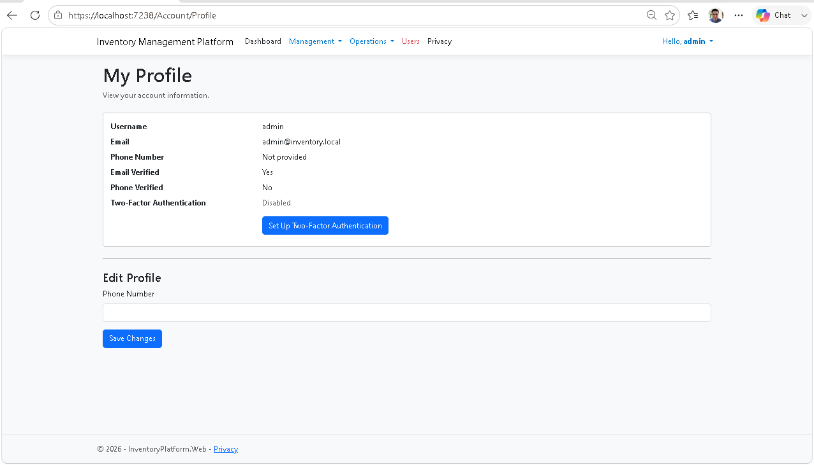

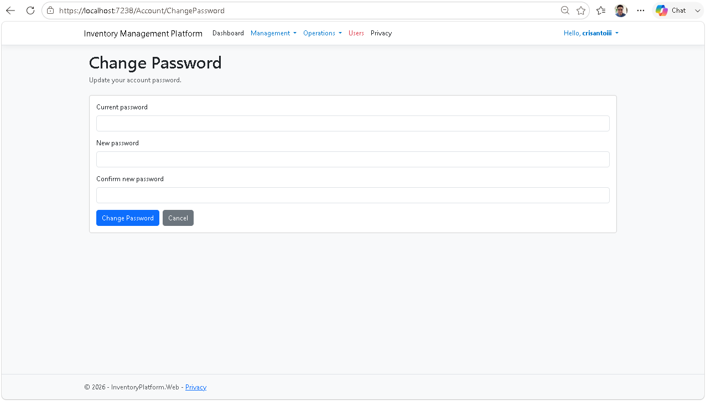

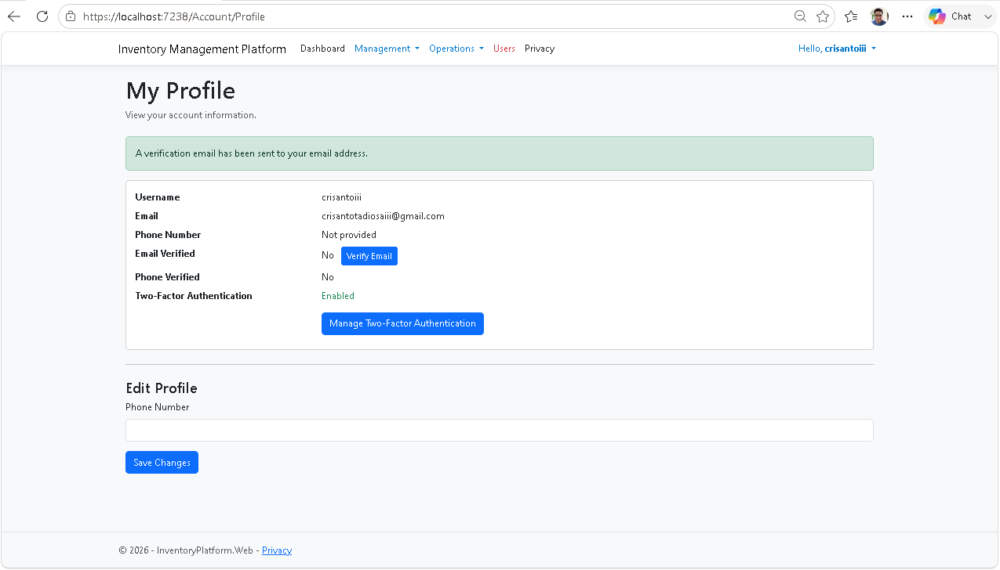

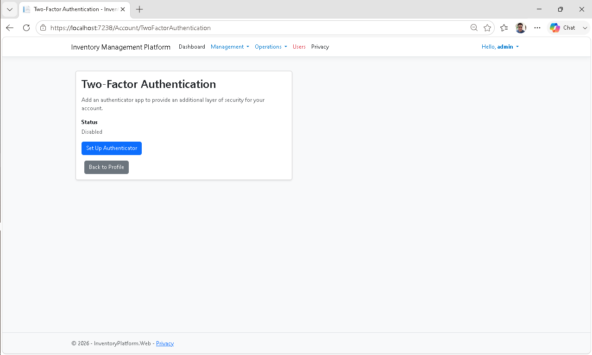

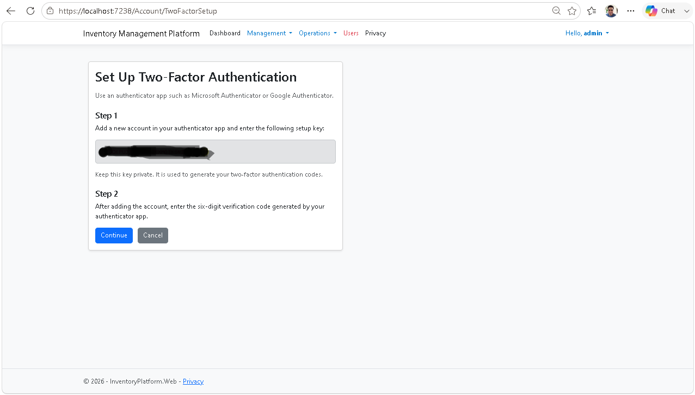

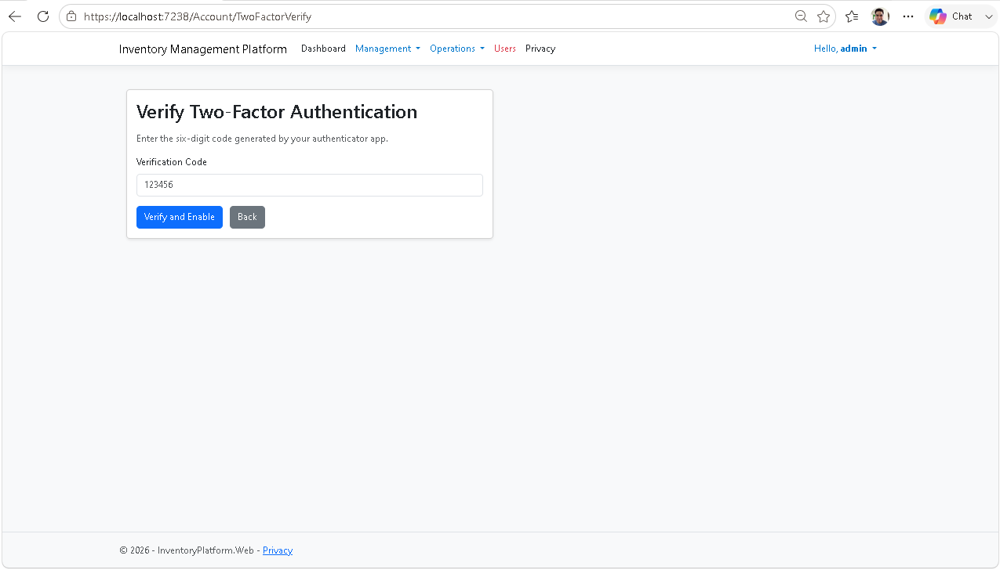

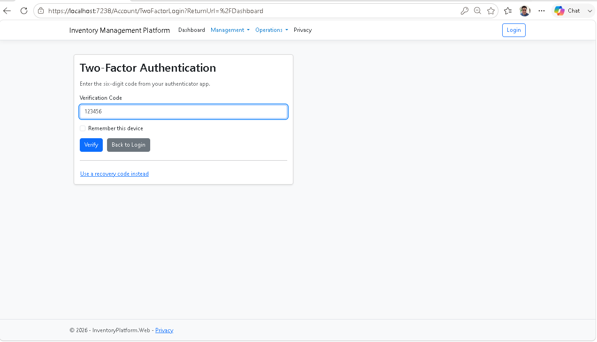

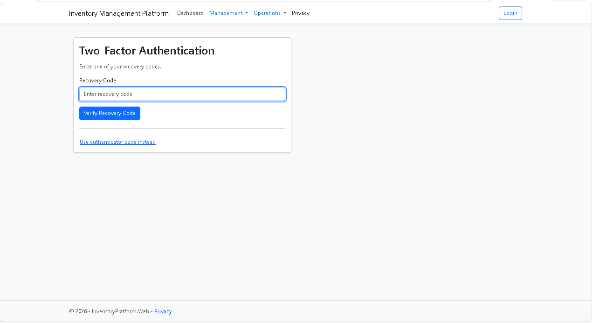

### Purchasing

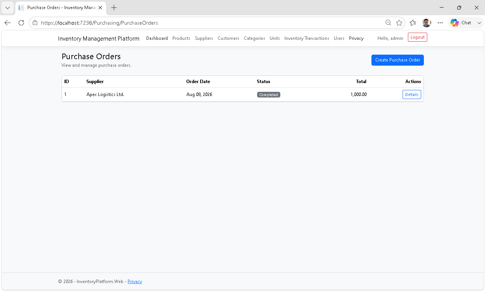


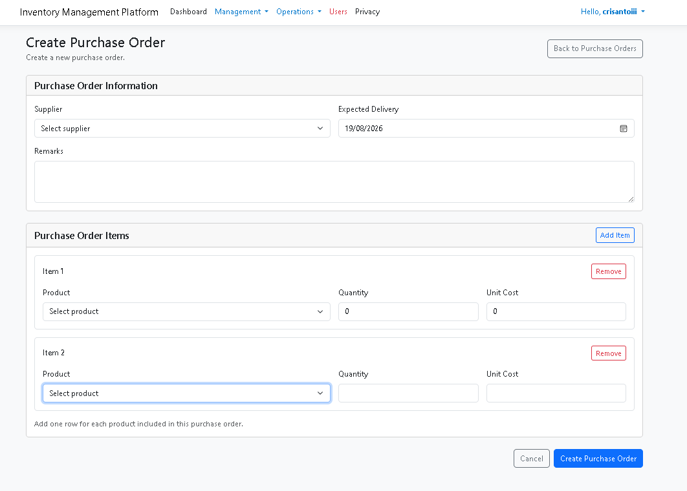

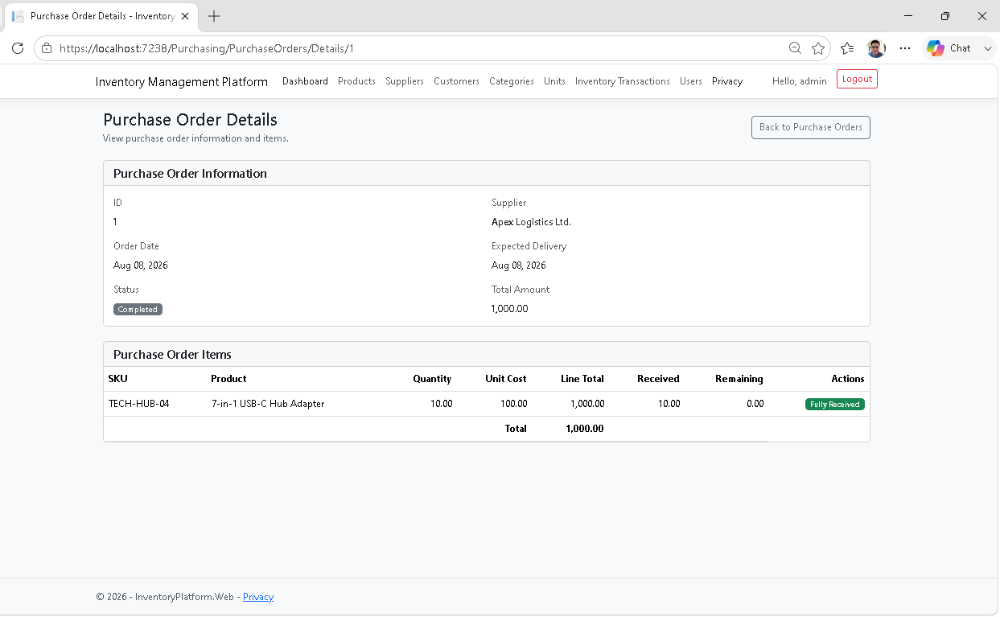

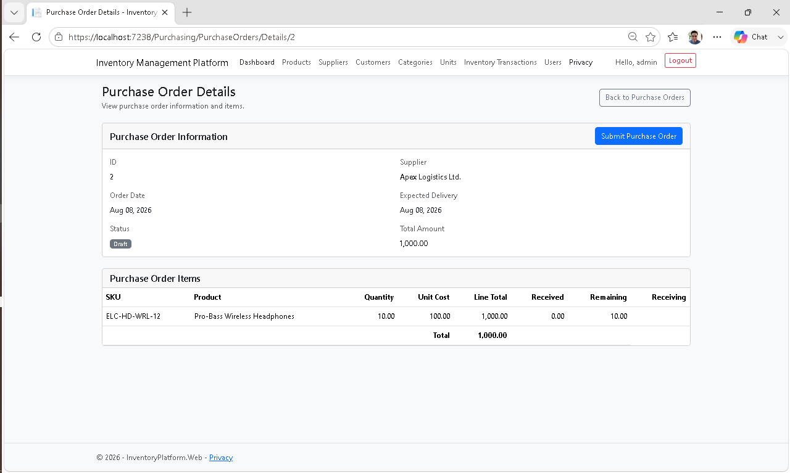

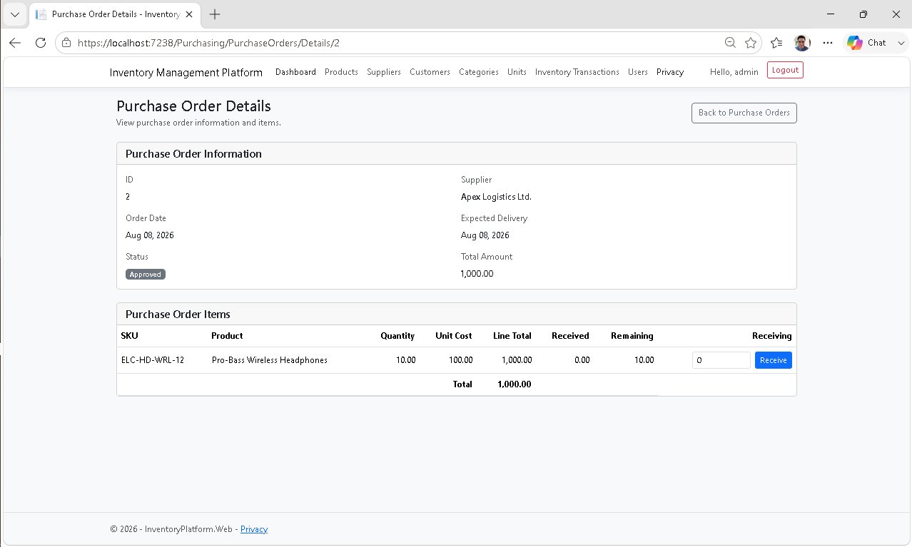

### Reporting

#### Completed Reporting

- Inventory Valuation
- Purchase History
- Supplier Purchase Analysis
- Stock Movement
- Low Stock Report
- Inventory Movement Report
- Product Reports
- Excel Export
- PDF Export

#### Final Verification

Sprint 7 Additional Reporting passed final project-wide verification, including reporting workflows, Excel/PDF exports, empty-database behavior, query-failure recovery, authorization regression, and final solution build verification.

#### Inventory Valuation

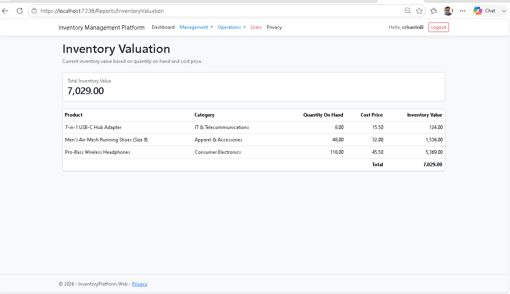

---

# Learning Objectives

This project is focused on applying modern enterprise development practices including:

- Separation of Concerns
- SOLID Principles
- Clean Architecture
- Maintainable Code
- Reusable Components
- Enterprise Business Application Design
- Scalable Repository Design
- Enterprise Authentication
- Identity Management
- Authorization
- Feature-based Architecture
- CQRS-inspired Design
- Result Pattern
- Rule of Three Refactoring
- Enterprise Code Review
- Architecture Validation
- Rich Domain Modeling
- Workflow-driven Enterprise Applications
- Vertical Slice Architecture
- Aggregate Design
- End-to-End Vertical Slice Implementation
- Workflow-driven Presentation Design
- Presentation-to-Application Integration
- Business Workflow Validation
- Read-oriented Reporting Architecture
- DTO Projection
- Database-side Reporting Queries
- EF Core Query Translation
- Reporting Vertical Slices
- Self-Service Account Management
- Email Verification
- Two-Factor Authentication
- Recovery Code Management
- Identity Security Workflows
- Authentication Challenge Flows

---

# License

This project is intended for educational and portfolio purposes.
