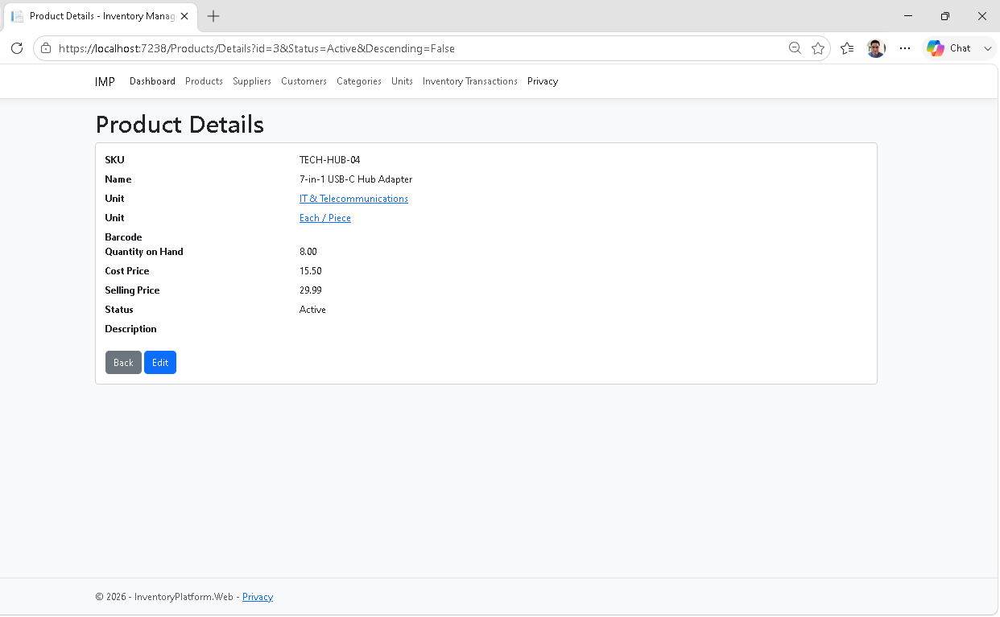
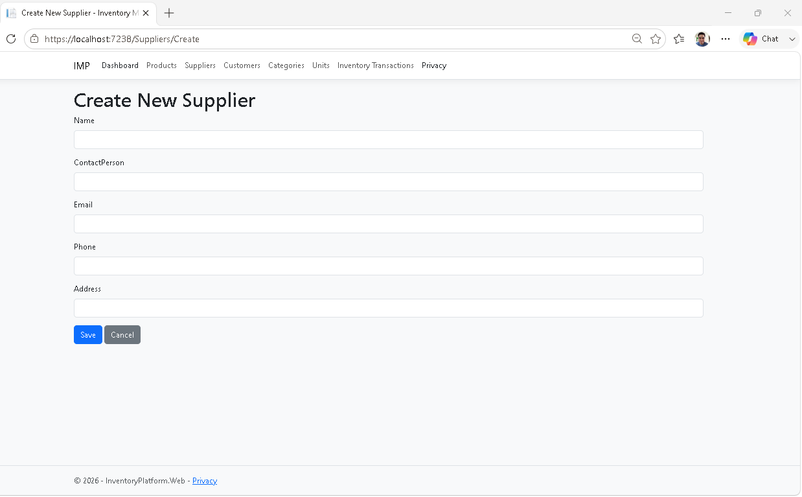
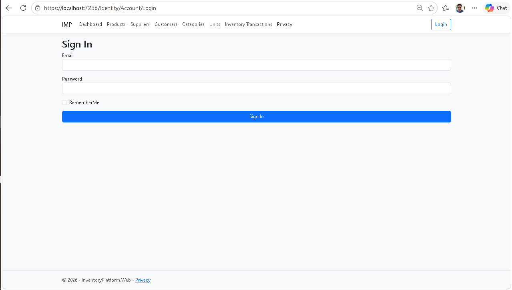
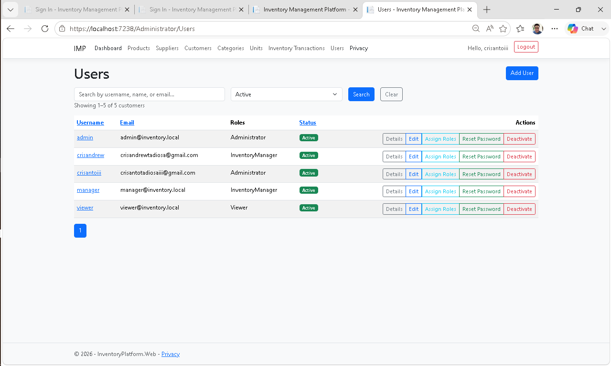
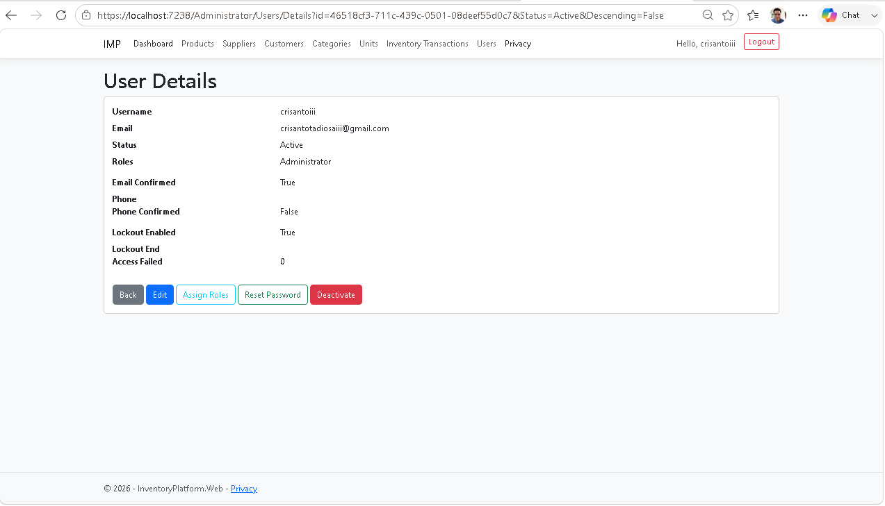
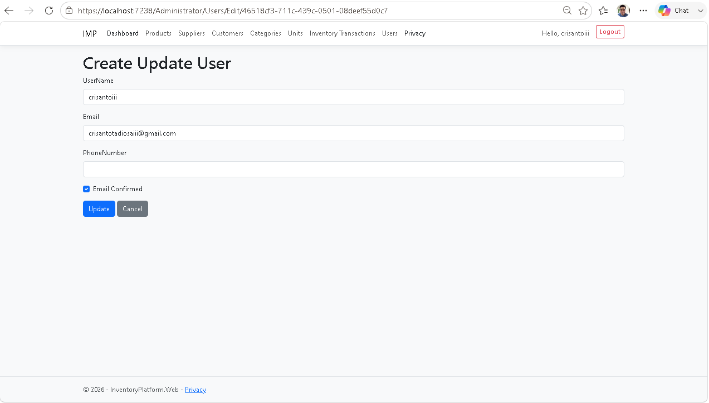
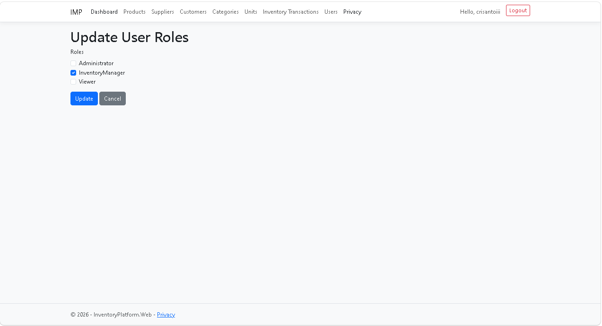
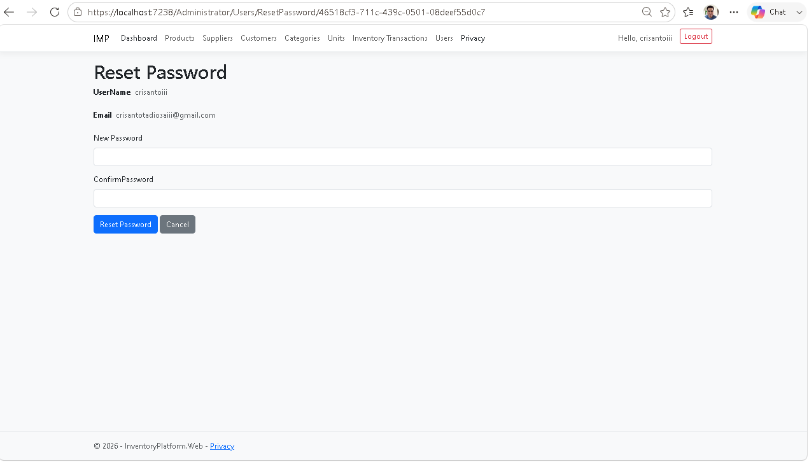
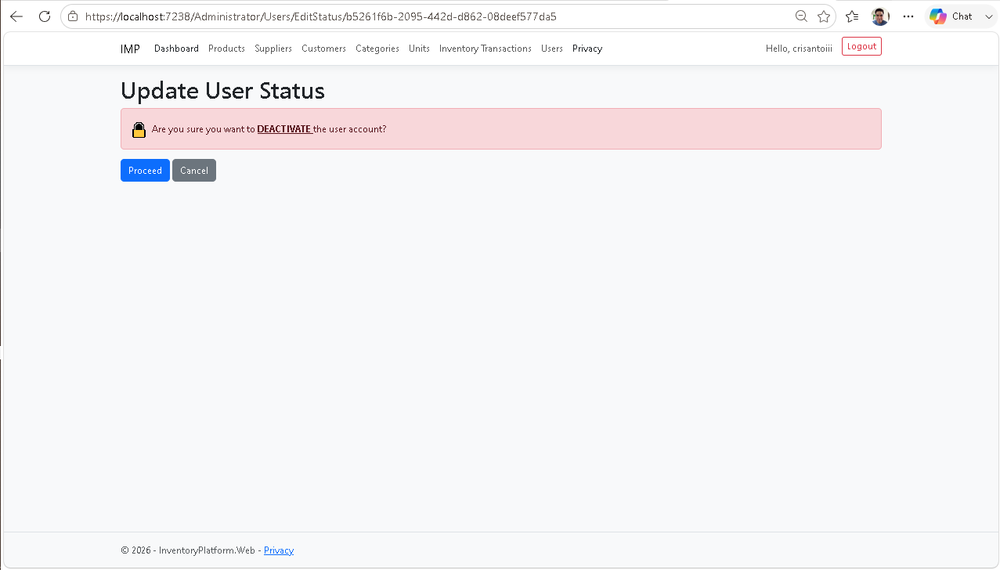

# Inventory Management Platform
> A production-style Inventory Management Platform built with **ASP.NET Core 10**, **Clean Architecture**, **Rich Domain Modeling**, **CQRS-inspired Application Layer**, and **Entity Framework Core**. The project demonstrates enterprise software development practices through modular business capabilities, workflow-driven domain models, and maintainable architecture.

The project is designed as a production-style portfolio application that demonstrates enterprise software development practices including layered architecture, reusable infrastructure, server-side data processing, and maintainable code organization.

---

## Highlights

- Enterprise-style Clean Architecture
- ASP.NET Core 10 Razor Pages
- Entity Framework Core 10
- CQRS-inspired Application Layer
- Inventory transaction workflow with immutable history
- Server-side search, sorting, and pagination
- Reusable shared infrastructure
- Business analytics dashboard
- ASP.NET Core Identity Authentication
- Enterprise User Management
- Workflow-driven Purchasing module
- Rich Domain Model
- Vertical Slice Architecture


---

# Why This Project?

Many portfolio projects demonstrate CRUD functionality. This project goes beyond CRUD by emphasizing maintainable architecture, enterprise development practices, and scalable software design.

The focus is not only on implementing business features but also on applying professional engineering practices such as architectural reviews, feature-based organization, incremental refactoring, and comprehensive documentation.

---

## Project Status

**Current Version:** v1.0.0 – Purchasing Application Layer

## Completed Modules

- ✅ Product Management
- ✅ Category Management
- ✅ Supplier Management
- ✅ Customer Management
- ✅ Unit Management
- ✅ Inventory Transactions
- ✅ Dashboard
- ✅ Authentication & Authorization
- ✅ User Management
- 🟨 Purchasing (Application Layer Complete)

## Latest Release 

### v1.0.0 — Purchasing Application Layer

Highlights

- Implemented Purchase Order workflows
- Introduced workflow-driven business processes
- Added CQRS-style command and query handlers
- Validated Rich Domain Model architecture
- Extended architecture without structural redesign


---

## Architecture Validation

The project completed **Architecture Sprint 1**, a comprehensive architectural review covering the Application, Infrastructure, and Web layers.

Sprint 3 successfully validated the architecture by implementing the first workflow-driven business module (Purchasing) without requiring architectural redesign.

This confirmed that the existing architecture scales from CRUD-oriented modules to workflow-driven business processes without requiring structural redesign.

### Review Outcome

- ✅ Application layer validated
- ✅ Infrastructure layer validated
- ✅ Web layer validated
- ✅ Architecture approved for future module expansion

The review concluded that the existing architecture scales successfully without requiring structural redesign.

---

# Project Goals

This project aims to demonstrate:

- Clean Architecture
- Repository Pattern
- Result Pattern
- Dependency Injection
- Entity Framework Core
- Razor Pages
- Server-side Searching
- Server-side Sorting
- Server-side Pagination
- Reusable Filtering Infrastructure
- Scalable Module Design

The long-term goal is to evolve this project into a complete inventory management system suitable for small and medium-sized businesses.

---

# Enterprise Features

- Clean Architecture
- Repository Pattern
- Unit of Work
- Result Pattern
- CQRS-style Application Layer
- Entity Framework Core Configurations
- Server-side Paging
- Server-side Sorting
- Server-side Filtering
- Soft Activation / Deactivation
- Shared Infrastructure
- Inventory Transaction History
- Inventory Audit Trail
- Immutable Business Records
- Automatic Stock Management
- Business Dashboard
- ASP.NET Core Identity
- Cookie Authentication
- Role-based Authorization
- User Management
- Password Management
- Architecture Review Process
- Feature-first Organization
- ASP.NET Core Identity Isolation
- Engineering Documentation
- Rich Domain Model
- Vertical Slice Architecture
- Workflow-driven Business Processes
- Dedicated Read Models
- Business-oriented Application Handlers

---

# Current Features

## Product Management

### Product Lifecycle

- ✅ Create Product
- ✅ View Product Details
- ✅ Edit Product
- ✅ Activate Product
- ✅ Deactivate Product
- ✅ Add Barcode
- ✅ Dropdown Category
- ✅ Dropdown Unit
- ✅ Add Quantity On Hand

### Product Listing

- ✅ Server-side Search
- ✅ Server-side Pagination
- ✅ Server-side Sorting
- ✅ Status Filtering
- ✅ Success Notifications

## Category Management

### Category Lifecycle

- ✅ Create Category
- ✅ View Category Details
- ✅ Edit Category
- ✅ Activate Category
- ✅ Deactivate Category

### Category Listing

- ✅ Server-side Search
- ✅ Server-side Pagination
- ✅ Server-side Sorting
- ✅ Status Filtering
- ✅ Success Notifications

## Supplier Management

### Supplier Lifecycle

- ✅ Create Supplier
- ✅ View Supplier Details
- ✅ Edit Supplier
- ✅ Activate Supplier
- ✅ Deactivate Supplier

### Supplier Listing

- ✅ Server-side Search
- ✅ Server-side Pagination
- ✅ Server-side Sorting
- ✅ Status Filtering
- ✅ Success Notifications

## Customer Management

### Customer Lifecycle

- ✅ Create Customer
- ✅ View Customer Details
- ✅ Edit Customer
- ✅ Activate Customer
- ✅ Deactivate Customer

### Customer Listing

- ✅ Server-side Search
- ✅ Server-side Pagination
- ✅ Server-side Sorting
- ✅ Status Filtering
- ✅ Success Notifications

## Inventory Transactions

### Inventory Workflow

- ✅ Create Inventory Transaction
- ✅ View Transaction Details
- ✅ Stock In
- ✅ Stock Out
- ✅ Stock Adjustment

### Transaction Listing

- ✅ Server-side Search
- ✅ Server-side Pagination
- ✅ Server-side Sorting
- ✅ Success Notifications

### Business Rules

- ✅ Immutable transaction history
- ✅ Automatic Quantity On Hand updates
- ✅ Stock validation
- ✅ Inventory audit trail

## Purchasing

### Implemented Features

- ✅ Create Purchase Order
- ✅ Get Purchase Order
- ✅ Get Purchase Orders
- ✅ Submit Purchase Order
- ✅ Approve Purchase Order
- ✅ Receive Purchase Order

### Workflow
```text
Draft

↓

Submitted

↓

Approved

↓

Receiving

↓

Completed
```

### Architectural Highlights

- Rich Domain Model
- Vertical Slice Architecture
- Workflow-driven Business Processes
- Dedicated Read Models
- Business-oriented Application Handlers

### Domain Design

- Rich Domain Model
- Workflow-driven state transitions
- Aggregate-based business behavior
- Thin Application handlers

## Dashboard

### Dashboard Overview

- ✅ Inventory statistics
- ✅ Inventory value summary
- ✅ Recent inventory transactions
- ✅ Low stock products
- ✅ Refresh dashboard

### Dashboard Widgets

- ✅ Product statistics
- ✅ Inventory value
- ✅ Recent transactions
- ✅ Low stock monitoring
- ✅ Empty state handling

## User Management

### Authentication

- ✅ Login
- ✅ Logout
- ✅ Cookie Authentication
- ✅ Role-based Authorization
- ✅ ASP.NET Core Identity
- ✅ Identity Cookie Authentication

### User Lifecycle

- ✅ Create User
- ✅ View User Details
- ✅ Edit User
- ✅ Activate User
- ✅ Deactivate User
- ✅ Reset Password

### Role Management

- ✅ Assign Roles

### User Listing

- ✅ Server-side Search
- ✅ Server-side Pagination
- ✅ Server-side Sorting
- ✅ Status Filtering

---

# Architecture

The solution follows a layered Clean Architecture approach.

```text
InventoryPlatform
│
├── InventoryPlatform.Web
│
├── InventoryPlatform.Application
│
├── InventoryPlatform.Domain
│
├── InventoryPlatform.Infrastructure
│
└── InventoryPlatform.Shared
```

## Inventory Transaction Workflow

```text
Create Transaction
        │
        ▼
Application Handler
        │
        ▼
Domain Logic
        │
        ▼
Update Product Quantity
        │
        ▼
Persist Inventory Transaction
        │
        ▼
Return Result
```

## Purchasing Workflow

```text
Create Purchase Order

↓

Application Handler

↓

PurchaseOrder Aggregate

↓

Repository

↓

Save Changes

↓

Result
```

The Dashboard demonstrates how multiple read models can be composed through the Application layer while preserving the separation between presentation, business logic, and persistence.

Responsibilities:
```text
InventoryPlatform
│
├── Web
│     Razor Pages
│
├── Application
│     Features
│     Handlers
│
├── Domain
│     Entities
│
├── Infrastructure
│     EF Core
│     Identity
│
└── Shared
      Paging
      Filtering
      Sorting
```

## Solution Architecture
```text
Request

↓

Razor Page

↓

Application Handler

↓

Domain Aggregate

↓

Repository / IdentityService

↓

Entity Framework Core

↓

SQL Server
```

## Architectural Principles

- Feature-first organization
- Clean Architecture
- Thin Razor PageModels
- Thin Application Handlers
- Business logic isolated from the Presentation layer
- ASP.NET Core Identity encapsulated behind IIdentityService
- Incremental refactoring guided by the Rule of Three
- Vertical Slice Architecture
- Request / Response / Handler pattern
- Rich Domain Model
- Workflow-oriented business commands
- Dedicated Read Models

---

## Architecture Validation

Architecture Sprint 1 confirmed:

- Thin Application Handlers
- Rich Domain Model
- Repository Pattern
- Unit of Work
- Identity Isolation
- Feature-first organization
- Razor Pages architecture

No major architectural redesign was required.

---

## Implemented Patterns

- Clean Architecture
- Repository Pattern
- Unit of Work
- CQRS-style Application Layer
- Result Pattern
- FluentValidation
- Dependency Injection
- Entity Framework Core Configurations
- Razor Pages
- Feature-based Architecture
- ASP.NET Core Identity
- Role-based Authorization
- Dependency Injection Extensions
- Thin PageModels
- Thin Handlers
- Feature-first Architecture
- Architecture Review Process
- Rule of Three Refactoring
- Vertical Slice Architecture
- Rich Domain Model
- Workflow-driven Business Processes
- Dedicated Read Models

---

# Key Design Decisions

- Inventory transactions are immutable.
- Product quantity is maintained through domain methods.
- Stock movements are recorded for every inventory change.
- Business logic resides in the Application and Domain layers.
- Razor Pages interact only with the Application layer.
- Dashboard data is composed using read-only DTO projections optimized for reporting.
- Identity operations are encapsulated behind IIdentityService.
- Authentication uses ASP.NET Core Identity.
- Administrative user management is separated from self-service account management.
- Business logic remains outside the Razor Pages.
- Purchase Orders are implemented as workflow-driven aggregates.
- Business behavior resides inside Domain entities.
- Application handlers orchestrate workflows rather than implement business rules.

---

# Shared Infrastructure

Reusable infrastructure has been implemented to support future modules.

## Paging

- PagedRequest
- PagedQuery
- PagedResult\<T>

## Filtering

- StatusFilter enum (shared across all modules)

## Sorting

- ProductSortFields
- CategorySortFields
- SupplierSortFields
- CustomerSortFields
- UnitSortFields
- InventoryTransactionSortFields
- UserSortFields
- RoleOption

## Result Pattern

- Result
- Result\<T>

This infrastructure is currently shared across the Product, Category, Supplier, Customer, Unit, Inventory Transaction, and Purchasing modules.

---

# Technology Stack

Backend

- ASP.NET Core 10
- Razor Pages
- Entity Framework Core 10
- SQL Server
- LINQ
- Microsoft ASP.NET Core Identity

Architecture

- Clean Architecture
- Repository Pattern
- Dependency Injection
- Result Pattern

Frontend

- Bootstrap 5
- HTML5
- CSS3

Development Tools

- Visual Studio 2026
- Git
- GitHub
- SQL Server Management Studio

---

# Current Progress

| Module | Status |
|----------|--------|
| Product Management | ✅ Complete |
| Category Management | ✅ Complete |
| Supplier Management | ✅ Complete |
| Customer Management | ✅ Complete |
| Unit Management | ✅ Complete |
| Inventory Transactions | ✅ Complete |
| Dashboard | ✅ Complete |
| Authentication & Authorization | ✅ Complete |
| User Management | ✅ Complete |
| Purchasing | 🟨 Application Layer Complete (UI Pending) |
| Reporting | ⬜ Planned |

---

# Roadmap

## Completed

- Product Management
- Category Management
- Supplier Management
- Customer Management
- Unit Management
- Inventory Transactions
- Dashboard
- Authentication & Authorization
- User Management
- Architecture Sprint 1

## Next

- v1.1.0 — Purchasing Presentation Layer

## Future

- Sales
- Reporting
- Audit Logging
- Self-Service Account Management
- Two-Factor Authentication

---

# Screenshots

The following screenshots demonstrate the current implementation:

### Product Management




### Category Management


### Supplier Management





### Customer Management


### Unit Management


### Inventory Transactions


### Dashboard


### Authentication & Authorization


### User Management







### Purchasing

> Screenshots will be added after the Purchasing Presentation Layer is completed.

---

# Learning Objectives

This project is focused on applying modern enterprise development practices including:

- Separation of Concerns
- SOLID Principles
- Clean Architecture
- Maintainable Code
- Reusable Components
- Enterprise Business Application Design
- Scalable Repository Design
- Enterprise Authentication
- Identity Management
- Authorization
- Feature-based Architecture
- CQRS-inspired Design
- Result Pattern
- Rule of Three Refactoring
- Enterprise Code Review
- Architecture Validation
- Rich Domain Modeling
- Workflow-driven Enterprise Applications
- Vertical Slice Architecture
- Aggregate Design

---

# License

This project is intended for educational and portfolio purposes.
